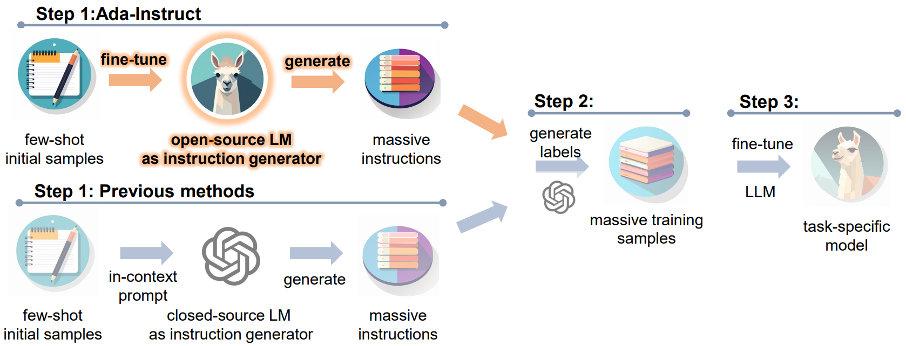

# Ada-Instruct: Adapting Instruction Generators for Complex Reasoning

[](https://github.com/tatsu-lab/stanford_alpaca/blob/main/LICENSE)
[](https://github.com/tatsu-lab/stanford_alpaca/blob/main/DATA_LICENSE)
[](https://www.python.org/downloads/release/python-3100/)

This is the repository for [Ada-Instruct: Adapting Instruction Generators for Complex Reasoning](https://arxiv.org/pdf/2310.04484.pdf).

## <a id="overview"></a>Overview

Ada-Instruct is an adaptive instruction generator developed by fine-tuning open-source LLMs. With a mere 10 samples, Ada-Instruct generates long and  high-quality instructions that maintain distributional consistency for complex reasoning tasks.

<p align="center" width="100%">
<a ></a>
</p>

## Installation

### Create conda environment
```Bash
conda create -n adainst python=3.10 && conda activate adainst
``` 

### Install dependencies
```Bash
pip install -r requirements.txt
```

## How to obtain massive training samples relying solely on 10 samples with Ada-Instruct?

### 1. Fine-tune an open-source LLM on few-shot initial samples

**For Humaneval**, we use the following fine-tuning format (**Code LLAMA** as our base model):
```
[INST] You are an expert Python programmer, complete the function below based on its docstring and the given test cases:\n{Question}\nYour code should start with a [PYTHON] tag and end with a [/PYTHON] tag. [/INST] [PYTHON]\n# pass\n[/PYTHON]
```

**For MBPP**, we use the following fine-tuning format (**Code LLAMA** as our base model):
```
[INST] You are an expert Python programmer, and here is your task: {Question}\nYour code should pass these tests:\n\n{Test Cases}\nYour code should start with a [PYTHON] tag and end with a [/PYTHON] tag. [/INST] [PYTHON]\n# pass\n[/PYTHON]
```

**For GSM8k** and **MATH**, we use the following fine-tuning format (**LLAMA 2** as our base model):
```
[INST] You are expert at solving math problems that require multi-step reasoning, and here is your task:\n{Question} [/INST] Let’s think step by step.\n
```

**For CommonsenseQA**, we use the following fine-tuning format (**LLAMA 2** as our base model):
```
[INST] You are expert at commonsense reasoning, and here is your task: {Question}\nA. {Text of Label A}\nB. {Text of Label B}\nC. {Text of Label C}\nD. {Text of Label D}\nE. {Text of Label E} [/INST] 
```

If you'd like to fine-tune on your own task (in the typical case of **few-shot initial samples**), generally, we recommend a training epoch of **40** and a learning rate of **1e-6**. Lower learning rate may suit a harder task, while fewer training epochs may suit a easier task.

### 2. Generate instructions with the fine-tuned open-source LLM

Multi-GPU generation:
```Bash
accelerate launch run_synthesize_instructions.py \
    --base_model <fine-tuned open-source LLM> \
    --task_name <specific task, currently support "humaneval", "mbpp", "gsm8k", "math", "csqa"> \
    --synthesize_num <how many instructions you desire> \
    --batch_size <batch size per gpu> \
    --out_file <path to the output file, will produce a json file>
```

A workaround for "RuntimeError: probability tensor contains either `inf`, `nan` or element < 0" is to  alter to Single-GPU generation:
```Bash
python run_synthesize_instructions.py \
    --base_model <fine-tuned open-source LLM> \
    --task_name <specific task, currently support "humaneval", "mbpp", "gsm8k", "math", "csqa"> \
    --synthesize_num <how many instructions you desire> \
    --batch_size <batch size per gpu> \
    --out_file <path to the output file, will produce a json file>
```

### 3. Generate labels for the instructions

Before label generation, **you should put your openai api_keys in "available" field of "./openai_keys.json"**.

Run the following command for asynchronous label generation:
```Bash
python run_complete_instructions.py \
    --task_name <specific task, currently support "humaneval", "mbpp", "gsm8k", "math", "csqa"> \
    --in_file <input file, produced in "2. Generate instructions with the fine-tuned open-source LLM">
    --out_file <path to the output file, will produce a json file>
```

### 4. (Optional) Verify the generated samples (for HumanEval and MBPP)

For HumanEval and MBPP, We regard those **generated code correctly passing the test cases** as **correct samples**. Run the following command to verify and get correct samples:
```Bash
python run_verification.py \
    --task_name <specific task, currently support "humaneval", "mbpp"> \
    --in_file <input file, produced in "3. Generate labels for the instructions">
    --out_file <path to the output file, will produce a json file>
    --do_task_verification
```
In this paper, we report the results of training on samples that didn't go through this process.

## Data

We release all data files (in **data/ada-instruct** directory) we generated and used to train LLMs in [Step 3](#overview), including:
- [humaneval_synthesized_6.4k.jsonl](https://github.com/wangitu/Ada-Instruct/blob/main/data/ada-instruct/humaneval_synthesized_6.4k.jsonl)
- [mbpp_synthesized_10k.jsonl](https://github.com/wangitu/Ada-Instruct/blob/main/data/ada-instruct/mbpp_synthesized_10k.jsonl)
- [gsm8k_synthesized_10k.jsonl](https://github.com/wangitu/Ada-Instruct/blob/main/data/ada-instruct/gsm8k_synthesized_10k.jsonl)
- [math_synthesized_10k.jsonl](https://github.com/wangitu/Ada-Instruct/blob/main/data/ada-instruct/math_synthesized_10k.jsonl)
- [csqa_synthesized_10k.jsonl](https://github.com/wangitu/Ada-Instruct/blob/main/data/ada-instruct/csqa_synthesized_10k.jsonl)

We also release the data files (in **data/alpaca** directory) for these tasks except CommonsenseQA using **Self-Instruct** (refined alpaca version):
- [humaneval_alpaca_1k.jsonl](https://github.com/wangitu/Ada-Instruct/blob/main/data/alpaca/humaneval_alpaca_1k.jsonl) (without labels)
- [mbpp_alpaca_1k.jsonl](https://github.com/wangitu/Ada-Instruct/blob/main/data/alpaca/mbpp_alpaca_1k.jsonl)
- [gsm8k_alpaca_10k.jsonl](https://github.com/wangitu/Ada-Instruct/blob/main/data/alpaca/gsm8k_alpaca_10k.jsonl)
- [math_alpaca_10k.jsonl](https://github.com/wangitu/Ada-Instruct/blob/main/data/alpaca/math_alpaca_10k.jsonl)

## Results

Here are the results of Ada-Instruct on standard benchmark datasets. All the results are obtained with 8 A800 GPUs (80GB). For more training and evaluation details, please refer to our [paper](https://arxiv.org/pdf/2310.04484.pdf).

### Code Completion (pass@1)

| Model | Params | HumanEval | MBPP |
| :---: | :---: | :---: | :---: |
| Code LLAMA-Python (base) | 13B | 43.3 | 49.0 |
| Ada-Instruct-HumanEval | 13B | 64.0 | - |
| Ada-Instruct-MBPP | 13B | - | 55.6 |

### Math (pass@1)

| Model | Params | GSM8k | MATH |
| :---: | :---: | :---: | :---: |
| LLAMA 2 (base) | 13B | 28.7 | 3.9 |
| Ada-Instruct-GSM8k | 13B | 48.7 | - |
| Ada-Instruct-MATH | 13B | - | 8.8 |

### CommonsenseQA

| Model | Params | CommonsenseQA |
| :---: | :---: | :---: |
| LLAMA 2 (base) | 13B | 59.0 | 
| Ada-Instruct-CSQA | 13B | 75.5 |


## Citation

If you find this codebase useful in your research, please cite the following paper.
```
@article{cui2023ada,
  title={Ada-Instruct: Adapting Instruction Generators for Complex Reasoning},
  author={Cui, Wanyun and Wang, Qianle},
  journal={arXiv preprint arXiv:2310.04484},
  year={2023}
}
```
